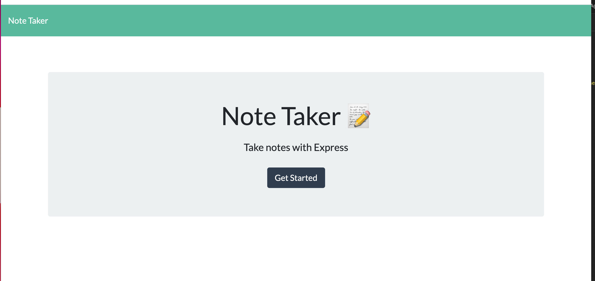

# note-taker

## Table of Contents
* [Description](#description)
* [Installation](#installation)
* [Usage](#usage)
* [Credit](#credit)

## Description 
This app was made for the user to use a note tracker. Whether is reminders throughout the day, a shopping list they need to make a note of, or fun facts they want to remember. THe user can use this app to keep track of whatever notes they may have.

## Installation 
1. Clone the <a href="https://github.com/angeeg/note-taker.git">github repo</a> onto your machine in the directory you want to save it in. 
2. Open the repo in your code editor. 
3. Open the terminal in your code editor and run 'npm i' then run 'npm start' to invoke the application and start the server. 

## Usage 
This app was meant to keep track of the user's notes. Use it to keep track of your notes of things you need to do or remember.

### Technologies Used:
* Node 
* Express
* Insomnia Core 

## Credit
This project was created by <a href="https://github.com/angeeg">angeeg</a>.
## Test 
1. Run 'npm i jest' in the terminal to make sure the npm jest package is installed. 
2. In the 'package-json' under the "Scripts" section replace ' "test": "echo \"Error: no test specified\" && exit 1" ' with ' "test": "jest" '.
3. You must then create a folder in the root directory titled `__tests__` and create a files within that folder where you will input functionality you wish to test. 
4. To run a test, in the command line type 'npm test' and the jest package will run a test on the code in that folder. 

## License 
BSD_3

## Contribute 
If you wish to contribute to this application please send a pull request. 
## Questions
If you have any questions please contact <a href="https://github.com/angeeg">angeeg</a>.